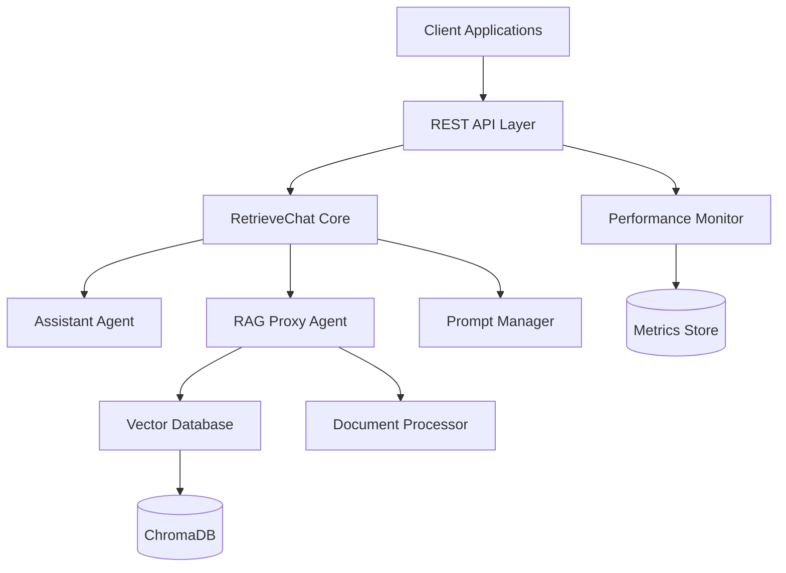
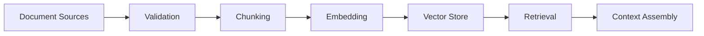
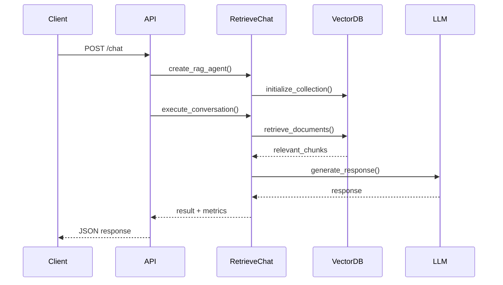
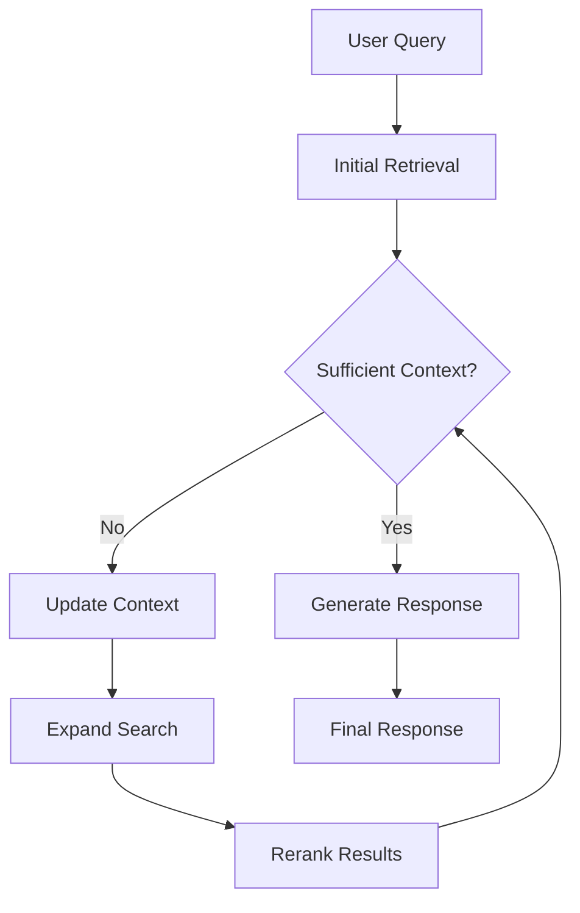

# AutoGen RetrieveChat System Architecture

## System Overview

The AutoGen RetrieveChat system implements a sophisticated multi-agent conversational AI architecture with retrieval-augmented generation (RAG) capabilities.



## Core Components

### 1. Multi-Agent Architecture

**Assistant Agent**
- LLM-powered reasoning engine
- Handles conversation logic
- Generates contextual responses
- Supports multiple model backends (OpenAI, Anthropic)

**RAG Proxy Agent** 
- Document retrieval and processing
- Vector similarity search
- Dynamic context management
- Automatic context updating

### 2. Document Processing Pipeline



**Stages:**
1. **Validation**: Format checking, accessibility verification
2. **Chunking**: Intelligent text segmentation with overlap
3. **Embedding**: Vector representation using sentence transformers
4. **Storage**: Persistent storage in ChromaDB
5. **Retrieval**: Similarity-based document retrieval
6. **Context Assembly**: Dynamic context construction

### 3. Vector Database Layer

**ChromaDB Integration**
- Persistent vector storage
- Efficient similarity search
- Collection management
- Metadata filtering

**Configuration:**
```python
chroma_settings = Settings(
    chroma_db_impl="duckdb+parquet",
    persist_directory="./chroma_db",
    anonymized_telemetry=False
)
```

### 4. Prompt Engineering System

**PromptManager Components**
- Task-specific prompt templates
- Dynamic prompt generation
- Validation and optimization
- Custom prompt support

**Prompt Types:**
- Code generation prompts
- Q&A prompts  
- Multi-hop reasoning prompts
- Domain-specific prompts (healthcare, research)

## Data Flow Architecture

### Request Processing Flow



### Context Update Flow



## Scalability Architecture

### Horizontal Scaling

**Stateless Design**
- No server-side session state
- Database handles persistence
- Load balancer distribution

**Container Orchestration**
```yaml
apiVersion: apps/v1
kind: Deployment
metadata:
  name: retrievechat
spec:
  replicas: 5
  strategy:
    type: RollingUpdate
    rollingUpdate:
      maxSurge: 2
      maxUnavailable: 1
```

### Performance Optimization

**Caching Strategy**
- Document embedding cache
- Conversation result cache
- Model response cache

**Resource Management**
- Connection pooling
- Async processing where possible
- Memory-efficient chunking

## Security Architecture

### API Security
- Rate limiting per client
- Input validation and sanitization
- CORS configuration
- Authentication middleware ready

### Data Security
- API key encryption
- Secure secret management
- Audit logging
- PII data handling

### Infrastructure Security
```yaml
# Network policies
apiVersion: networking.k8s.io/v1
kind: NetworkPolicy
metadata:
  name: retrievechat-policy
spec:
  podSelector:
    matchLabels:
      app: retrievechat
  policyTypes:
  - Ingress
  - Egress
  ingress:
  - from:
    - podSelector:
        matchLabels:
          app: load-balancer
```

## Monitoring Architecture

### Performance Metrics
- Response time percentiles
- Throughput (requests/second)
- Error rates and types
- Resource utilization

### Business Metrics
- Conversation success rate
- Document retrieval accuracy
- User satisfaction scores
- Model performance metrics

### Alerting
```yaml
# Prometheus alerting rules
groups:
- name: retrievechat
  rules:
  - alert: HighErrorRate
    expr: rate(http_requests_total{status!="200"}[5m]) > 0.1
    for: 2m
    annotations:
      summary: "High error rate detected"
```

## Technology Stack

### Core Technologies
- **Python 3.9+**: Primary language
- **AutoGen**: Multi-agent framework
- **ChromaDB**: Vector database
- **Flask**: Web framework
- **Docker**: Containerization

### ML/AI Stack
- **OpenAI GPT**: Primary LLM
- **Anthropic Claude**: Alternative LLM
- **Sentence Transformers**: Embedding models
- **Hugging Face**: Model ecosystem

### Infrastructure
- **Kubernetes**: Container orchestration
- **Prometheus**: Metrics collection
- **Grafana**: Visualization
- **Redis**: Caching
- **PostgreSQL**: Metadata storage

## Design Patterns

### Factory Pattern
```python
class AgentFactory:
    def create_agent(self, agent_type, config):
        if agent_type == "assistant":
            return AssistantAgent(config)
        elif agent_type == "rag":
            return RAGProxyAgent(config)
```

### Strategy Pattern
```python
class PromptStrategy:
    def generate_prompt(self, task_type, context):
        strategy = self.get_strategy(task_type)
        return strategy.create_prompt(context)
```

### Observer Pattern
```python
class PerformanceMonitor:
    def notify(self, event, data):
        for observer in self.observers:
            observer.handle_event(event, data)
```

## Extension Points

### Custom Models
- Plugin architecture for new LLM providers
- Model adapter interface
- Configuration-driven model selection

### Custom Retrievers
- Document source adapters
- Embedding model interfaces
- Retrieval strategy plugins

### Custom Processors
- Document type handlers
- Custom chunking strategies
- Metadata extractors

This architecture provides a robust, scalable foundation for production deployment while maint
